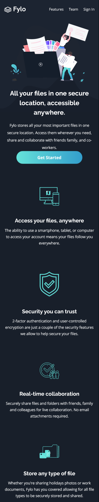

# Frontend Mentor - Fylo dark theme landing page solution

This is a solution to the [Fylo dark theme landing page challenge on Frontend Mentor](https://www.frontendmentor.io/challenges/fylo-dark-theme-landing-page-5ca5f2d21e82137ec91a50fd). Frontend Mentor challenges help you improve your coding skills by building realistic projects. 

## Table of contents

- [Frontend Mentor - Fylo dark theme landing page solution](#frontend-mentor---fylo-dark-theme-landing-page-solution)
  - [Table of contents](#table-of-contents)
  - [Overview](#overview)
    - [The challenge](#the-challenge)
    - [Screenshot](#screenshot)
    - [Links](#links)
  - [My process](#my-process)
    - [Built with](#built-with)
    - [What I learned](#what-i-learned)
    - [Useful resources](#useful-resources)
  - [Author](#author)

## Overview

### The challenge

Users should be able to:

- View the optimal layout for the site depending on their device's screen size
- See hover states for all interactive elements on the page

### Screenshot
**Desktop**

**Mobile**

### Links

- Solution URL: [Github](https://github.com/gylim0604/FrontEnd-Mentor-Flyo-dark-theme-landing-page)
- Live Site URL: [Vercel](https://front-end-mentor-flyo-dark-theme-landing-page.vercel.app/)

## My process

### Built with

- [Next.js](https://nextjs.org/) - React framework
- [Chakra-UI](https://chakra-ui.com/) - React component library
- [Formik](https://formik.org/) - React form library
- Mobile-first workflow
- Flexbox
- CSS Grid

### What I learned

I am once again trying to build more stuff with Next.js And Chakra-UI. For now still liking this combination, haven't encountered anything that would require alot of effort to work around. 

Important takeaways from this project is learning how to use Formik to simplify the form validation process. It definitely made it easier to do form control using the library as oppose to building everything for scratch. 

Another thing I got to delve more into was SVGs. Learnt abit more about svg properties such as the viewbox and how to handle fills. Will definetly be useful, and would want to understand it more. 

### Useful resources

- [Chakra Ui Form control](https://chakra-ui.com/docs/form/form-control) - The example here helped me figure out how to get Formik to work with Chakra. 
- [MDN Web Docs](https://developer.mozilla.org/en-US/docs/Web/SVG/Attribute/viewBox) - Helped me get a better understanding of the viewBox property for SVGs.

## Author

- Frontend Mentor - [@gylim0604](https://www.frontendmentor.io/profile/gylim0604)

